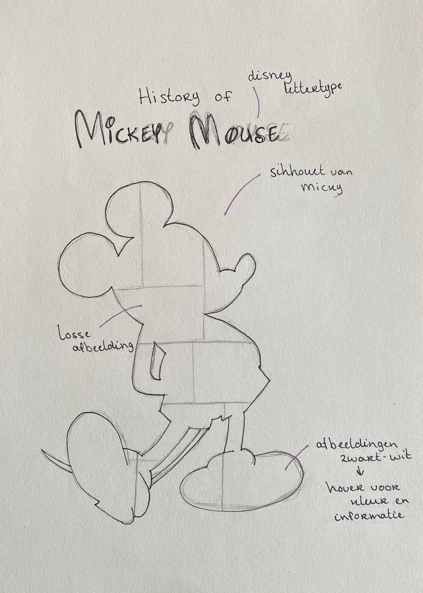

# Procesverslag
Markdown is een simpele manier om HTML te schrijven.  
Markdown cheat cheet: [Hulp bij het schrijven van Markdown](https://github.com/adam-p/markdown-here/wiki/Markdown-Cheatsheet).

Nb. De standaardstructuur en de spartaanse opmaak van de README.md zijn helemaal prima. Het gaat om de inhoud van je procesverslag. Besteedt de tijd voor pracht en praal aan je website.

Nb. Door *open* toe te voegen aan een *details* element kun je deze standaard open zetten. Fijn om dat steeds voor de relevante stuk(ken) te doen.

## Jij

### Ontwerper:
Nadia Molenaar

#### Je startniveau:
Mijn startniveau is: voornamelijk blauw, misschien een klein beetje richting rood, omdat er al veel lessen html/css in het verleden geweest zijn.

# Je plan

  
Code vind ik altijd even wennen, dus het zal voornamelijk lastig worden een overlay te maken en/of afbeeldingen op de juiste wijze weer te geven in het silhouet.

  ### De eerste versie/schets:
  

  ### Je ambitie: 
  Aan deze technieken/punten wil ik werken:
  - CSS
  - Animeren
  - JavaScript
 

## Voortgang/Feedback 1

  
Mijn bevindingen + wijzigingen (minimaal 5)

  ### Bevinding 1:
  Het gebruik van secties in de HTML.

  #### oplossing:
  Secties veranderd naar div.

  ### Bevinding 2:
  Het omdraaien van de H1-H6, niet in de juiste volgorde.

  #### oplossing:
  H1-H6 in de juiste volgorde gezet en deze met CSS gestileerd.

  ### Bevinding 3:
  Afbeeldingen kunnen niet (juist) worden weergegeven.
  
  ### oplossing:
  Afbeeldingen in buttons gezet.
  
  ### Bevinding 4:
  Bij mijn @font-face pakt hij het lettertype alleen als er een extra ')' achter de link staat. Hier komt een foutmelding van, maar als ik hem weghaal doet het lettertype het niet.
  
  ### oplossing:
  Een ander lettertype gedownload en de url aangepast in de CSS.
  
  ### Bevinding 5:
  Omdat ik geen gebruik wil maken van classes heb ik in de CSS een selector gebruikt (div > h1), maar de selector doet niet wat ik wil.
  
  ### oplossing:
  Toch gebruik gemaakt van een class & ID, omdat dit ook gemakkelijker is bij het gebruik van JS.
  

## Voortgang/Feedback 2

  
Mijn bevindingen + wijzigingen (minimaal 5)

  
  ### Bevinding 1:
  Complete paniek over het wiel dat ik wilde laten draaien...

  #### oplossing:
  Samen met Sanne code geschreven in de CSS, waardoor een awesome wiel is ontstaan. Van de afbeeldingen buttons gemaakt, die ik daarna 'gevuld' heb met de juiste afbeelding.

  ### Bevinding 2:
  Het wiel moest bij klikken op een button stoppen met draaien, zodra er dan weer geklikt werd moet hij verder draaien. Helaas dit gebeurde (nog) niet.

  #### oplossing:
  In JS heb ik een functie gemaakt waarbij het wiel gestopt wordt. In CSS heb ik er toen een animatie opgezet dat hij gepauzeerd wordt, zodat hij daarna weer verder kan draaien.

  
  
  ### Bevinding 3:
  Bij het runnen in de browser krijg ik 4 fouten: hij kan de lettertypes niet downloaden van de website waar het font afkomstig van is.
  
  #### oplossing:
  Het pad naar de lettertypes en de url aangepast in de CSS.
  
  
  
  ### Bevinding 4:
  Met de tab-toets worden links op de pagina niet geselecteerd; deze worden overgeslagen
  
  ### oplossing:
  Helaas niet gevonden...
  
  
  
  ### Bevinding 5:
  Geen gebruik van id's en classes.
  
  ### oplossing:
  Bij de div, p en a toch een class en id toegevoegd om in JS de elementen aan te kunnen spreken.

## Voortgang/Feedback 3

  
Mijn bevindingen + wijzigingen (minimaal 5)

  
  ### Bevinding 1:
  Omschrijving van wat er nog niet orde was (tekst en afbeeding(en)).

  #### oplossing:
  Beschrijving hoe je het hebt hebt opgelost of als het niet gelukt is hoe je het zou oplossen (tekst en afbeeding(en)).

  ### Bevinding 2:
  Omschrijving van wat er nog niet orde was (tekst en afbeeding(en)).

  #### oplossing:
  Beschrijving hoe je het hebt hebt opgelost of als het niet gelukt is hoe je het zou oplossen (tekst en afbeeding(en)).

  ### Bevinding 3:
  ...

## Reflectie

  
Mijn eindresultaat & persoonlijke ontwikkeling

  ### Je uitkomst - karakteristiek screenshot(s):
  

  ### Dit ging goed/Heb ik geleerd: 
  Korte omschrijving met plaatje(s)

  

  ### Dit was lastig/Is niet gelukt:
  Korte omschrijving met plaatje(s)

  

## Bronnenlijst

continu bijhouden terwijl je werkt

Nb. Wees specifiek ('css-tricks' als bron is bijv. niet specifiek genoeg).

1. Pinterest: hier heb ik inspiratie opgedaan voor mijn 'tijdlijn'.
2. Afbeeldingen
    

      Afbeelding 1928:
      https://www.vhv.rs/viewpic/hbRmx_original-mickey-mouse-1928-hd-png-download/.
      
      Afbeelding 1930:
      http://ramapithblog.blogspot.com/2012/06/mouse-interrupted.html.
      
      Afbeelding 1935 - Band Concert
      https://www.jiangekj.xyz/ProductDetail.aspx?iid=20412703&pr=41.88.
      
      Afbeelding 1939 - Surprise Party
      https://disneytoonland.tumblr.com/post/28606236309/mickeys-surprise-party-1939
      
      Afbeelding 1952 - Pluto's Birthday
      https://d.newsweek.com/en/full/1546612/mickey-mouse-plutos-party.jpg?w=790&f=84de7171ddaa03865c6c6aca360c87df
      
      Afbeelding 1999 - Works
      https://mubi.com/nl/films/mickey-mouse-works
      
      Afbeelding 2004 - Twice Upon A Christmas
      https://m.imdb.com/title/tt0424279/mediaviewer/rm2127650048/
      
      Afbeelding 2018
      https://kidscreen.com/2018/03/05/disney-celebrates-90-years-of-mickey-mouse/
  

      
3. Evolutie van Mickey Mouse in video: https://www.youtube.com/watch?v=k5yLBt2EfLc
4. Ronde image-slider: https://codemyui.com/arc-like-image-slider/
5. Info over Mickeys film uit 2004: https://www-cornel1801-com.translate.goog/disney/Mickeys-Twice-Upon-a-Christmas-2004/movie-film.html?_x_tr_sl=en&_x_tr_tl=nl&_x_tr_hl=nl&_x_tr_pto=op,sc
6. Fonts:
  

    https://www.fontsquirrel.com/fonts/roboto
    https://www.dafont.com/mickey.font
  

7. ...

