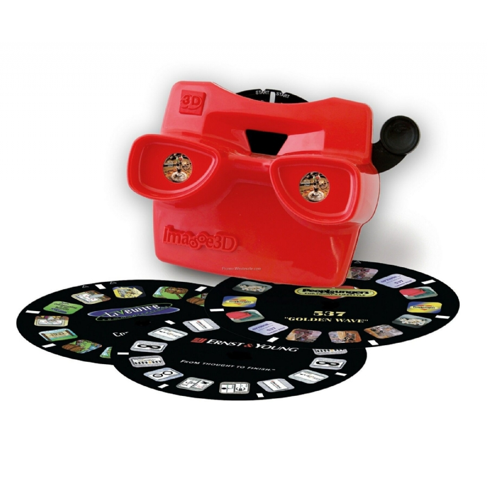

# Procesverslag
Markdown is een simpele manier om HTML te schrijven.  
Markdown cheat cheet: [Hulp bij het schrijven van Markdown](https://github.com/adam-p/markdown-here/wiki/Markdown-Cheatsheet).

Nb. De standaardstructuur en de spartaanse opmaak van de README.md zijn helemaal prima. Het gaat om de inhoud van je procesverslag. Besteedt de tijd voor pracht en praal aan je website.

Nb. Door *open* toe te voegen aan een *details* element kun je deze standaard open zetten. Fijn om dat steeds voor de relevante stuk(ken) te doen.

## Jij

### Ontwerper:
Nadia Molenaar

#### Je startniveau:
Mijn startniveau is: voornamelijk blauw, misschien een klein beetje richting rood, omdat er al veel lessen html/css in het verleden geweest zijn.

# Je plan

  
Code vind ik altijd even wennen, dus het zal voornamelijk lastig worden een overlay te maken en/of afbeeldingen op de juiste wijze weer te geven in het silhouet.
  
  Bij nader inzien heb ik toch gekozen voor totaal iets anders: een dream viewer (ook wel bekend als viewmaster).

  ### De eerste versie/schets:
  
  

  ### Je ambitie: 
  Aan deze technieken/punten wil ik werken:
  - CSS
  - Animeren
  - JavaScript
 

## Voortgang/Feedback 1

  
Mijn bevindingen + wijzigingen (minimaal 5)

  ### Bevinding 1:
  Het gebruik van secties in de HTML.

  #### oplossing:
  Secties veranderd naar div.

  ### Bevinding 2:
  Het omdraaien van de H1-H6, niet in de juiste volgorde.

  #### oplossing:
  H1-H6 in de juiste volgorde gezet en deze met CSS gestileerd.

  ### Bevinding 3:
  Afbeeldingen kunnen niet (juist) worden weergegeven.
  
  ### oplossing:
  Afbeeldingen in buttons gezet.
  
  ### Bevinding 4:
  Bij mijn @font-face pakt hij het lettertype alleen als er een extra ')' achter de link staat. Hier komt een foutmelding van, maar als ik hem weghaal doet het lettertype het niet.
  
  ### oplossing:
  Een ander lettertype gedownload en de url aangepast in de CSS.
  
  ### Bevinding 5:
  Omdat ik geen gebruik wil maken van classes heb ik in de CSS een selector gebruikt (div > h1), maar de selector doet niet wat ik wil.
  
  ### oplossing:
  Toch gebruik gemaakt van een class & ID, omdat dit ook gemakkelijker is bij het gebruik van JS.
  

## Voortgang/Feedback 2

  
Mijn bevindingen + wijzigingen (minimaal 5)

  
  ### Bevinding 1:
  Complete paniek over het wiel dat ik wilde laten draaien...

  #### oplossing:
  Samen met Sanne code geschreven in de CSS, waardoor een awesome wiel is ontstaan. Van de afbeeldingen buttons gemaakt, die ik daarna 'gevuld' heb met de juiste afbeelding.

  ### Bevinding 2:
  Het wiel moest bij klikken op een button stoppen met draaien, zodra er dan weer geklikt werd moet hij verder draaien. Helaas dit gebeurde (nog) niet.

  #### oplossing:
  In JS heb ik een functie gemaakt waarbij het wiel gestopt wordt. In CSS heb ik er toen een animatie opgezet dat hij gepauzeerd wordt, zodat hij daarna weer verder kan draaien.

  
  
  ### Bevinding 3:
  Bij het runnen in de browser krijg ik 4 fouten: hij kan de lettertypes niet downloaden van de website waar het font afkomstig van is.
  
  #### oplossing:
  Het pad naar de lettertypes en de url aangepast in de CSS.
  
  
  
  ### Bevinding 4:
  Met de tab-toets worden links op de pagina niet geselecteerd; deze worden overgeslagen
  
  ### oplossing:
  Helaas niet gevonden...
  
  
  
  ### Bevinding 5:
  Geen gebruik van id's en classes.
  
  ### oplossing:
  Bij de div, p en a toch een class en id toegevoegd om in JS de elementen aan te kunnen spreken.

## Voortgang/Feedback 3

  
Mijn bevindingen + wijzigingen (minimaal 5)

  
  ### Bevinding 1:
  Hoveren over de buttons waarbij ze van greyscale naar kleur gaan.

  #### oplossing:
  Gespiekt op CodePen hoe anderen het deden, erachter gekomen dat het super simpel was en toen onderstaande code gebruikt om het toe te passen:
  
  

  

  ### Bevinding 2:
  Op de buttons een andere cursor toegepast, maar de afbeelding was veel te groot.

  #### oplossing:
  De afbeelding in adobe illustrator gemaakt met een verloopje, opgeslagen en deze in voorvertoning gewijzigd naar 32x32px. Nu past hij wel als cursor, maar is hij alsnog ietwat groot. 
  

  

  ### Bevinding 3:
  Gebruik gemaakt van custom properties.
  
  ### oplossing:
  Nog nooit eerder gedaan, maar het werkte vrij soepel. De custom properties worden onder andere gebruikt voor de verschillende states op linkjes.
  
  
  
  ### Bevinding 4
  Paragrafen en links bleven in beeld bij het klikken op de button, terwijl deze weer moesten verdwijnen. 
  
  ### oplossing:
  Met JS een functie gemaakt waarbij deze zichtbaar worden en weer verdwijnen.
  
  
  
  ### Bevinding 5
  Last minute wilde ik nog het jaartal toevoegen en laten verdwijnen met JS, zoals bij de paragrafen en links.
  
  
  
  ### oplossing:
  Het is niet gelukt dit op te lossen zoals ik wilde, maar ik heb nu het jaartal in de paragraaf gezet, zodat deze evengoed zichtbaar/leesbaar is. In JS wil ik dit nog wel laten werken. 

## Feedback gedurende beoordeling

  
Aanpassingen

  
  Gedurende de feedback die ik kreeg waren er een aantal punten waar ik nog aan kon werken. Mijn concept was onduidelijk en eigenlijk niet zo goed passend bij Mickey. Uiteindelijk heb ik ervoor gekozen het concept om te zetten naar een dreamviewer effect; een soort camera waar schijfjes in gaan met foto's. Deze camera is rond dezelfde tijd op de markt gebracht als dat Mickey werd gemaakt. Mickey heeft vanaf het begin van zijn tijd al enorm veel ronde elementen, zijn neus, oren, ogen en zelfs zijn schoen/voeten zijn in ronde vormen. Deze rondingen zijn door de jaren heen eigenlijk niet veranderd. De Mickey zoals we hem nu kennen is ook voorzien van veel rondingen. 
  
  De schijf met buttons duidt ook aan dat het iets 'onenidigs' is, daarnaast is Mickey zelf een karakter dat ook door de jaren heen vernieuwd wordt en eigenlijk niet meer is weg te denken uit de disney wereld. 

  Verder kreeg ik nog de feedback dat mijn CSS code iets netter kan, daarom heb ik alle kleuren in de :root gezet en onnodige CSS elementen verwijderd. Ook heb ik de ID's van de P en A elementen verwijderd en in JS deze elementen aangeroepen met een andere selector. 

## Reflectie

  
Mijn eindresultaat & persoonlijke ontwikkeling

  ### Je uitkomst - karakteristiek screenshot(s):
  Afbeelding 1:
  
      
  Afbeelding 2:
  
      
  Afbeelding 3:
  

  

  ### Dit ging goed/Heb ik geleerd: 
  Het ging in eerst instantie wel oke met het schrijven van de HTML en het eerste deel van de CSS. Daarna raakte ik in paniek, omdat ik niet wist waar ik moest beginnen met het wiel. Met behulp van Sanne is dit toch gelukt. 
      
  Het is me gelukt om een begrijpelijk JS te maken met werkende functies, die ik zelf begrijp. Ik heb geleerd hoe JS werkt en het is me duidelijker geworden hoe bepaalde functies werken die ik eerst niet begreep en erg lastig vond. Naast mijn eigen werk kon ik het ook uitleggen aan Job, wat voor mij betekent dat ik echt progressie heb gemaakt met JS. Iets wat ik graag wilde leren deze periode!
      

      

  
  ### Nieuw
  Het was eigenlijk best simpel om de P en A elementen met een andere selector aan te roepen. Ik heb deze simpelweg gewijzigd van een getElementById naar een querySelector, waardoor hij de elemten uit de html zelf haalt en niet op zoek gaat naar een class die matcht. 
  
  
  

  ### Dit was lastig/Is niet gelukt:
  Het is lastig om te weten wanneer je met de tab-toets alle elementen kunt gebruiken. Het is mij helaas niet gelukt om ervoor te zorgen dat de links in de paragrafen te bereiken zijn met de tab-toets. Daar baal ik van, maar ik wil dit nog wel leren!
  
  
  ### Nieuw
  Het is helaas niet gelukt om met een if/else statement te zorgen dat er meer interactie komt met de buttons op de schijf. Na meerdere pogingen met verschillende opties vind ik het jammer dat het niet werkt. Middels onderstaande code lukte het wel om in ieder geval 1 element de schijf te doen stoppen, waarna je kan klikken op een andere button. Dan verschijnt er wel een nieuwe tekst die hoort bij de button waarop geklikt is, maar zodra ik dit wilde toevoegen aan de andere functies ging hij kapot. 
  
  

## Bronnenlijst

continu bijhouden terwijl je werkt

Nb. Wees specifiek ('css-tricks' als bron is bijv. niet specifiek genoeg).

1. Pinterest: hier heb ik inspiratie opgedaan voor mijn 'tijdlijn'.
2. Afbeeldingen
    

      Afbeelding 1928:
      https://www.vhv.rs/viewpic/hbRmx_original-mickey-mouse-1928-hd-png-download/.
      
      Afbeelding 1930:
      http://ramapithblog.blogspot.com/2012/06/mouse-interrupted.html.
      
      Afbeelding 1935 - Band Concert
      https://www.jiangekj.xyz/ProductDetail.aspx?iid=20412703&pr=41.88.
      
      Afbeelding 1939 - Surprise Party
      https://disneytoonland.tumblr.com/post/28606236309/mickeys-surprise-party-1939
      
      Afbeelding 1952 - Pluto's Birthday
      https://d.newsweek.com/en/full/1546612/mickey-mouse-plutos-party.jpg?w=790&f=84de7171ddaa03865c6c6aca360c87df
      
      Afbeelding 1999 - Works
      https://mubi.com/nl/films/mickey-mouse-works
      
      Afbeelding 2004 - Twice Upon A Christmas
      https://m.imdb.com/title/tt0424279/mediaviewer/rm2127650048/
      
      Afbeelding 2018
      https://kidscreen.com/2018/03/05/disney-celebrates-90-years-of-mickey-mouse/
  

      
3. Evolutie van Mickey Mouse in video: https://www.youtube.com/watch?v=k5yLBt2EfLc
4. Ronde image-slider: https://codemyui.com/arc-like-image-slider/
5. Info over Mickeys film uit 2004: https://www-cornel1801-com.translate.goog/disney/Mickeys-Twice-Upon-a-Christmas-2004/movie-film.html?_x_tr_sl=en&_x_tr_tl=nl&_x_tr_hl=nl&_x_tr_pto=op,sc
6. Fonts:
     

       Roboto:
       https://www.fontsquirrel.com/fonts/roboto
       
       Mickey:
       https://www.dafont.com/mickey.font
     

